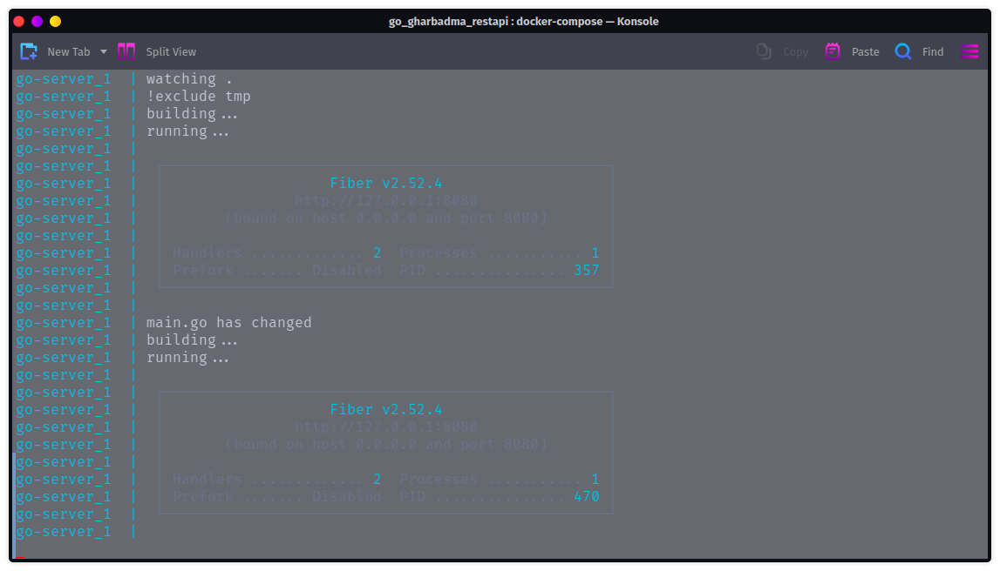

# Gharbhadma project server

Description:
 
    This is the backend portion of my website which is about providing nepali people with ease in navigating  rental homes, finding peers to join accomodate a common rental home. setting alerts for flat with desired specifications and many more features which current sites don't provide.

## Setup

### first time build

```bash
docker-compose up --build
```



### every time when u need to start

```bash
docker-compose up
```

### every time when u need to stop

```bash
docker-compose down
```

